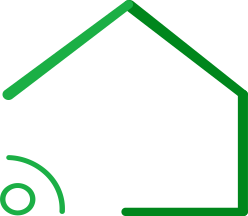
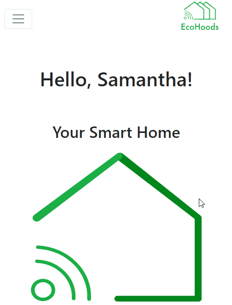

# EcoHoods 

PROJECT BUILT DURING THE [IBM HACKATHON 2019!](https://www.ibmhackbe.com) :computer:

This was a competition aimed to sell an idea to [Telenet](https://www2.telenet.be/content/www-telenet-be/nl/business/producten-diensten/internet-of-things) and [IBM](https://www.ibm.com/be-en). Telenet were looking for an innovative idea that could fit into their Smart Home services. IBM were looking for our idea to be built into their IBM Cloud services such as Watson and Node Red. 

Our idea was EcoHoods! Ecohoods is a platform that allows users to see how much money they have saved from using eco smart devices (e.g. eco friendly lightbulbs, solar panels, humidity sensors). It also gives users a digital community to hold each other accountable. Users can also gain points and become an influencer!

This was a group project built by a team of 4 developers. The objective was to sell an idea and create a mock up web app built with HTML, CSS, Bootstrap and JavaScript. 
We used the Agile Methodology to complete the task efficiently and on time. 

**Take a look ?** [Demo](https://walter-clayton.github.io/ecohoods/) :grin:

## User scenario:

"Samantha has some money to invest. She's also conscious about global warming. She asks her friend Jenny for some advice, who happens to also be a Telenet user. Jenny recommends her to use EcoHoods! She sends her an invite via email. Samantha directly connects into EcoHoods thanks to her Telenet digital ID. Samantha sees on her dashboard the money she has saved, her ecopoints, and her ranking. Thanks to Jenny, she's also part of a digital neighborhood called "Flower", who collectively save, gain points, and rankings. In order to gain points, she can connect her devices to her smart home. She can buy new smart devices on the preview page. She can see her rankings and compare herself to Jenny's page. She can also go into private mode. Watson is the EcoHoods bot, who will send her reminders if she needs motivation! She can also become an influencer by gaining points! "

Samantha is happy because she can save money  and the planet ! 

:moneybag: + :seedling: = :smile:

## Features

#### Dashboard
  * You can see your money saved, ecopoints, and rankings. 
  * You can see your community's money saved, ecopoints, and rankings.
---

#### Preview
  * You can see the impact of the devices. 
  * You can compare devices.
  * Includes money that can be saved, and community reviews.
  ---

#### Devices
  * You can scan your devices and connect them to your Smart Home through Device Id.
  * You can see if your devices are connected.
  ---

#### Become Influencer
  * You can earn points by sharing.
  * You can get discounts with at least 10 points.
  * You can earn money with a least 100 points.
  ---

#### Leaderboard
  * You can compare yourself to others.
  * You can compare your commnunity to others. 
  ---

## Instructions for contributors

if you would like to contribute 

:smiley: [Click here](contribute.md)

## Built with

* HTML5
* CSS3
* Javascript
* Bootstrap

## Authors :octocat:

 **Walter Clayton** - [GitHub](https://github.com/walter-clayton) [EN-FR]
 **Joseph Lindzius** - [GitHub](https://github.com/JosephLindzius) [EN-NL]
 **Matis Karamenderes** - [GitHub](https://github.com/MKaramen) [FR-EN]
 **Sander Dooms** - [GitHub](https://github.com/sanderdms) [EN-NL]

## Acknowledgment

* Thank you [BeCode](https://www.becode.org) for putting the team together!
* Inspired by [Telenet](https://www2.telenet.be/content/www-telenet-be/nl/business/producten-diensten/internet-of-things) and [IBM](https://www.ibm.com/be-en).

